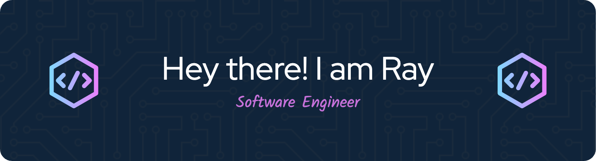

<!-- https://huemint.com/bootstrap-plus/#palette=cde6f5-ffffff-1f1410-004961-0075ac-469cc9-3e3a2b-361a4b-e4166a -->
<!-- badges -->
<p align="center">
    <a href="https://github.com/BEPb/BEPb"></a>
	
	
    
</p>


<!--   my-skilset -->

| Property | Data |
|-|-|
| **Programming Language**  |     				|
| **Domain Knownledge**  |    			|
| **Documentation Tools**  |    			|
| **Devops**  |    			|
| **Frameworks & Platform**   |        |
| **OS**  |  			|
| **Software**  |      			|

<!-- Snake Code Contribution Map -->
<!-- <picture>
  <source media="(prefers-color-scheme: dark)" srcset="https://cdn.jsdelivr.net/gh/srall123/srall123/profile-snake-contrib/github-contribution-grid-snake-dark.svg" />
  <source media="(prefers-color-scheme: light)" srcset="https://cdn.jsdelivr.net/gh/srall123/srall123/profile-snake-contrib/github-contribution-grid-snake.svg" />
  
</picture> -->
<picture>
  <source media="(prefers-color-scheme: dark)" srcset="./assets/github-snake-dark.svg" />
  <source media="(prefers-color-scheme: light)" srcset="./assets/github-snake.svg" />
  
</picture>

<!--  -->

<!--START_SECTION:waka-->
**I'm a Night 🦉** 

```text
🌞 Morning                173 commits         ███░░░░░░░░░░░░░░░░░░░░░░   12.72 % 
🌆 Daytime                266 commits         █████░░░░░░░░░░░░░░░░░░░░   19.56 % 
🌃 Evening                758 commits         ██████████████░░░░░░░░░░░   55.74 % 
🌙 Night                  163 commits         ███░░░░░░░░░░░░░░░░░░░░░░   11.99 % 
```
📅 **I'm Most Productive on Wednesday** 

```text
Monday                   119 commits         ██░░░░░░░░░░░░░░░░░░░░░░░   08.75 % 
Tuesday                  236 commits         ████░░░░░░░░░░░░░░░░░░░░░   17.35 % 
Wednesday                274 commits         █████░░░░░░░░░░░░░░░░░░░░   20.15 % 
Thursday                 196 commits         ████░░░░░░░░░░░░░░░░░░░░░   14.41 % 
Friday                   238 commits         ████░░░░░░░░░░░░░░░░░░░░░   17.50 % 
Saturday                 158 commits         ███░░░░░░░░░░░░░░░░░░░░░░   11.62 % 
Sunday                   139 commits         ███░░░░░░░░░░░░░░░░░░░░░░   10.22 % 
```


📊 **This Week I Spent My Time On** 

```text
💬 Programming Languages: 
C                        23 hrs 24 mins      █████████████████████████   98.08 % 
Other                    27 mins             ░░░░░░░░░░░░░░░░░░░░░░░░░   01.91 % 
Markdown                 0 secs              ░░░░░░░░░░░░░░░░░░░░░░░░░   00.01 % 

🐱‍💻 Projects: 
slmini                   23 hrs 51 mins      █████████████████████████   100.00 % 
```


 Last Updated on 13/04/2025 23:45:17 UTC
<!--END_SECTION:waka-->
